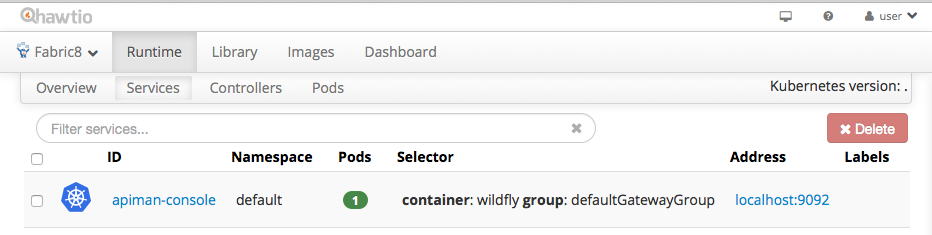

# APIMan Console

The APIMan Console is a APIMan deployment on top of Wildfly-8.2.0.Final. The console
allows you to manage Organizations, Users, Applications, Services and Policies that
all play their role in API Management. From the APIMan Console you can publish services
to remote gateways.


### Building this Application

The application comes as source code and pre-built binaries with the fabric8 distribution. If
you are using Docker and Kubernetes then set
```
export KUBERNETES_MASTER=http://openshifthost:8484
export FABRIC8_CONSOLE=http://localhost:8484/hawtio/
```
for Jube set
```
export KUBERNETES_MASTER=http://openshifthost:8585
export FABRIC8_CONSOLE=http://localhost:8585/hawtio/
```
To build from the source code:

1. Change your working directory to `apps/apiman` directory.
1. Run `mvn clean install` to build the app.
1. Run `mvn fabric8:deploy` to upload the application to the fabric container.

If you run the `fabric:deploy` command for the first then, it will ask you for the username and password to login the fabric container. And then store this information in the local Maven settings file. You can find more details about this on the fabric8 website about the [Maven Plugin](http://fabric8.io/gitbook/mavenPlugin.html).


## How to run this example

The following information is divided into two sections, whether you are using the command line shell in fabric, or using the web console

### Using the command line shell

1. Run `mvn fabric8:run` to start a container on fabric8. You should see it being provisioned in the console
http://localhost:8585/hawtio/



when you click on a the 'services' tab you should find the `apiman-console` service with an `Address` of 
http://localhost:9092, which means the apiman console can be found at http://localhost:9092/apiman-management.

### Using the web console

TBD


## How to use this application

This application assumes you have an Fabric8 HttpGateway deployed have Api management on it turned on (for details
please see the fabric8HttpGateway application). You can now navigate to the API management console at

http://localhost:9092/apiman-management

You will be prompted to login as either admin/admin123! or you can register a new user right from the `New user? Register` link. To update or add an admin user you will need to navigate to keycloak itself at (http://localhost:9092/auth). Please change the default admin password after first use.

You will now need to configure users, services and applications. More on this to follow.

http://vimeo.com/112063377


