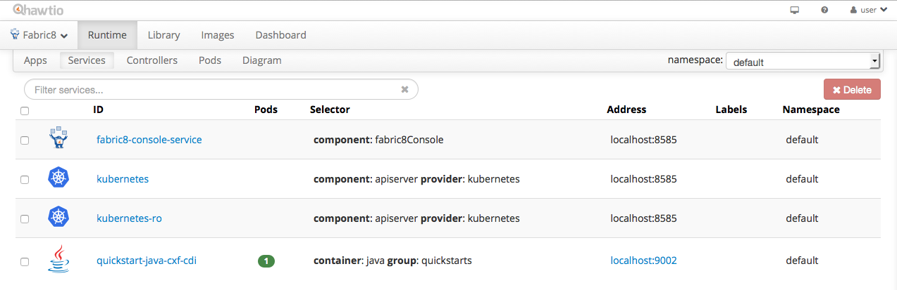
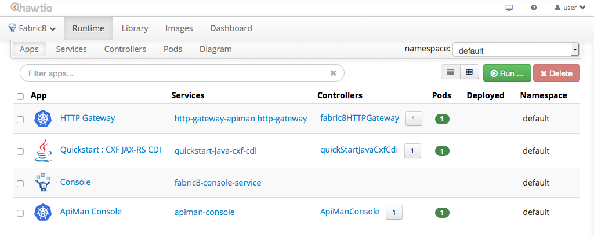
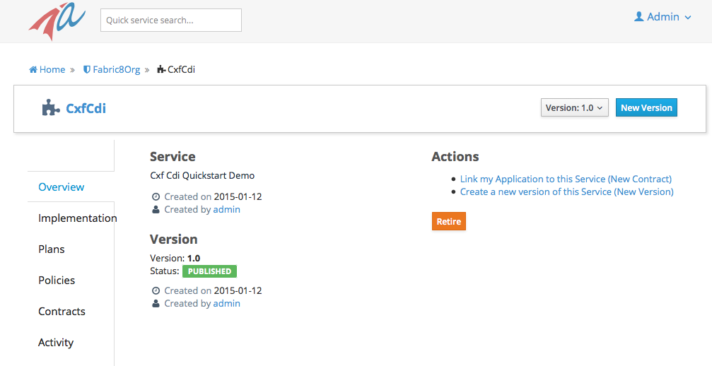

# APIMan Console

The APIMan Console is a APIMan deployment on top of Wildfly-8.2.0.Final. The console
allows you to manage Organizations, Users, Applications, Services and Policies that
all play their role in API Management. From the APIMan Console you can publish services
to remote gateways.

### Running the ApiMan Console

#### Using the Hawtio Console
To run the APIMan Console please click the `Run...` button on the Runtime > Apps screen and select
the `ApiMan Console` and click `Run Applications`, or use maven as described in the next section.

#### Using Maven, to build and run

The application comes as source code and pre-built binaries with the fabric8 distribution. If
you are using Docker and Kubernetes then set
```
export KUBERNETES_MASTER=http://openshifthost:8484
export FABRIC8_CONSOLE=http://localhost:8484/hawtio/
```
for Jube set
```
export KUBERNETES_MASTER=http://openshifthost:8585
export FABRIC8_CONSOLE=http://localhost:8585/hawtio/
```
To build from the source code change your working directory to `apps/apiman` directory. Note that if you run the `fabric8:deploy` command for the first then, it will ask you for the username and password to login the fabric container. And then store this information in the local Maven settings file. You can find more details about this on the fabric8 website about the [Maven Plugin](http://fabric8.io/gitbook/mavenPlugin.html).
```
mvn clean install fabric8:deploy
mvn fabric8:run
```
will start the apiman console running on wildlfy and it exposes the console at
```
http://localhost:9092/apiman-manager
```
You can login using admin/admin123!.

** Please use the keycloak GUI to change the default password at http://127.0.0.1:9092/auth/. **

## Register a micro-service as a public service

### Prerequisites

Please use either the Hawtio console, or the maven to run the Fabric8 HTTP Gateway and CXFCDI Quickstart Service. 

#### Using the Hawtio Console
Please click the `Run...` button on the Runtime > Apps screen and select
the the `HTTP Gateway` and the `Quickstart : CXF JAX-RS CDI`, and click `Run Applications`, or use maven as described in the next section.

#### Using maven

1. Run a backend service. For example run the cxfcdi service.
```
cd quickstarts/java/cxf-cdi
mvn clean fabric8:deploy
mvn fabric8:run
```
Check that the service is running using the hawtio console



You should see a service with ID 'quickstart-java-cxf-cdi' and 1 pod. You should be able to do a GET on

http://localhost:9002/quickstart-java-cxf-cdi/cxfcdi/customerservice/customers/123

and the following body should be returned
```
<Customer><id>123</id><name>John</name></Customer>
```

2. You need a running Fabric8 HttpGateway deployed and have API management on it turned on (for details please see the fabric8HttpGateway application). 

```
cd apps/fabric8-http-gateway
mvn clean fabric8:deploy 
mvn fabric8:run
```

### Check all three Application are running

You should now see the apps `HTTP Gateway`, `Quickstart: CXF JAX-RS CDI` and the `ApiMan Console`, all with one running pod. For now, do not start more then one pod for neither the Gateway nor the Console, as the apiman storage for in either application is not shared.



To double check you can use `jps -l` to verify the running java processes.

### Mirco-service registration

Now that the gateway, the backend service and the APIMan console are running, navigate to the API management console at

http://localhost:9092/apiman-management

You will be prompted to login. For this example we will use the admin user with credentials, admin/admin123! Note that from this screen you can register new users right from the `New user? Register` link. To update the admin password you will need to navigate to keycloak at (http://localhost:9092/auth).

The first think we need to is to delete the APIMan gateway configuration and to create a new one for the Fabric8 HTTP Gateway. On the home screen select the `Manage Gateway` link, and select the `The Gateway` so that you can delete it. Next click `New Gateway` and create the `Fabric8HTTPGateway` gateway with configuration endpoint `http://localhost:8999/rest/apimanager/`. At the moment this endpoint is unprotected, so type anything for the Username/password.

Next we need to create an Organization. On the Home screen select `Create a New Organization`, and create an Organization named `Fabric8Org`. 

Now we can create a `Public Service` by clicking on the `Create a New Service` link on the Home screen. The reason we use a public service is that it requires the least amount of configuration and is therefore the easiest to get started with. Give the new service the name `CxfCdi`, version 1.0 and description `Quickstart CXF JAX-RS CDI` and click `Create Service`. In the next screen under `Implementation` set `http://127.0.0.1:9002/quickstart-java-cxf-cdi/` as the endpoint, and `API Type` of `Rest`. Under `Plans` check `Make this service public` and under `Policies` select a `Rate Limiting Policy` with 5 requests per Service per Minute. Public Services don't require Contracts, so go back up to `Overview` and `Publish` the Service. 



This publishes the CxfCdi service to the ApiMan engine inside of the Fabric8HTTPGateway. This means that you can now see it mapped in the gateway at `http://127.0.0.1:9000/`, which should display the following JSON structure
```
{"/quickstart-java-cxf-cdi":["http://localhost:9002/quickstart-java-cxf-cdi"]}
```

and when you perform a GET on `[http://127.0.0.1:9000/quickstart-java-cxf-cdi/cxfcdi/customerservice/customers/123](http://127.0.0.1:9000/quickstart-java-cxf-cdi/cxfcdi/customerservice/customers/123)` it should now reply with 
```
<Customer><id>123</id><name>John</name></Customer>
```
but after 5 requests within a minute our rate limiting policy will get triggered resulting in a status code of 403 and a response message of `Rate limit exceeded.`

### Conclusion

You have seen a rate limiting policy in ApiMan getting triggered. For more complex service contracts please see the ApiMan documentation on the [http://www.apiman.io](http://www.apiman.io) website. Also note that work has started to integrate the ApiMan Console straight into Hawtio.